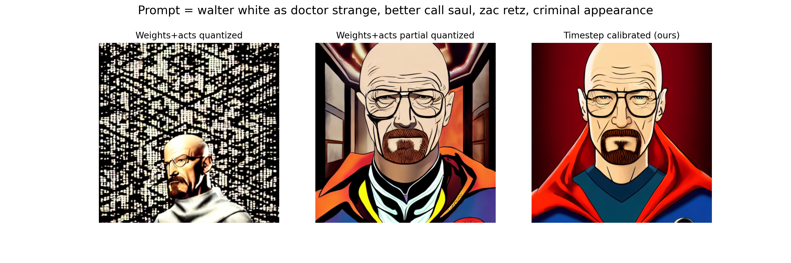
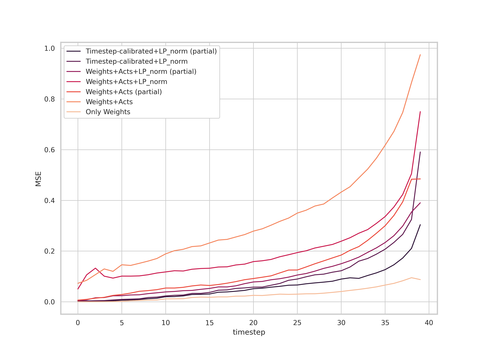
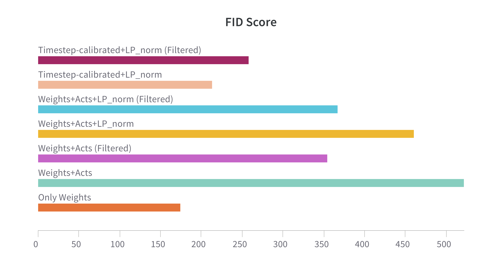
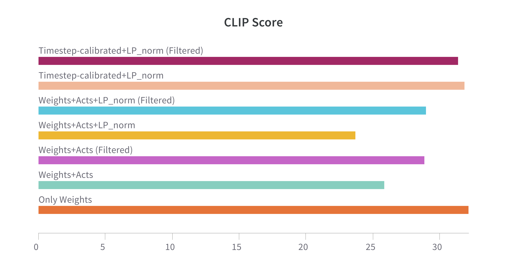
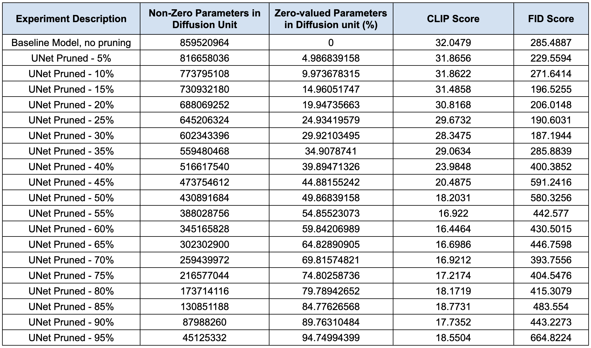
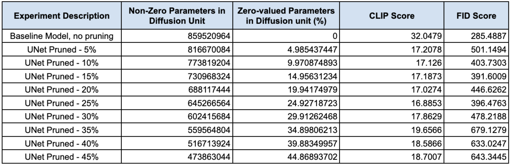
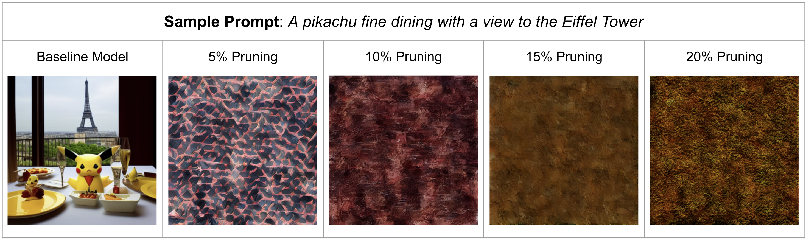
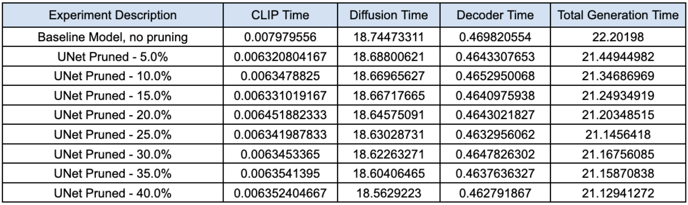
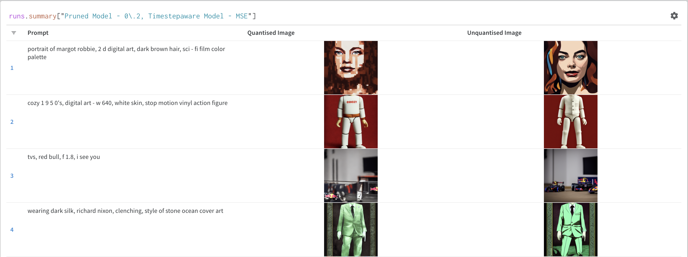

# Quantizing and Pruning Diffusion Models

```
Team Members: Pranjal Srivastava (ps3392), Rishabh Srivastava (rs4489)
```

## Project Overview

Diffusion models, particularly in image generation and representation learning, have demonstrated remarkable capabilities in capturing complex data distributions. However, since these models use an iterative refinement process and have multiple components, they need a lot of resources during inference. 

This project studies quantisation and pruning of Stable-diffusion. We also implement Time-step calibrated Quantisation, a new approach to account for timesteps in stable diffusion which significantly improves image generation quality after quantisation and is extremely light-weight and quick to calibrate.

<figure>
    <figcaption><b>Image generation quality examples</b></figcaption>
    
</figure>

Refer to the Wandb pages for more examples and experiments:
- [Timestep-calibrated-quantisation](https://wandb.ai/pranjal_sri/stable-diff-quantisation)
- [Pruning](https://api.wandb.ai/links/hpmlcolumbia/ta2q28tz)


## Code Structure

    README.md
    code
    ├── config_presets
    ├── data
    ├── quantisation
    ├── stable_diffusion
    ├── config.yaml
    ├── download_weights.sh
    ├── main.py
    ├── pruning_experiment.py
    ├── prune_quantize_model.py
    ├── pruning_profile_exp.py
    ├── quant_experiment_script.py
    ├── utility.py
    ├── prompts_train.txt
    ├── prompts_train.txt

The `data` folder contains the CLIP tokenizer vocabulary files, weights of the pre-trained Stable Diffusion model, and sample images used to calculate the FID score.

The `stable_diffusion` folder contains all the necessary code to create the Stable Diffusion model from the pre-trained model's weights.

The `quantisation` folder contains the modules for quantisation, including  Time-step aware quantisation.

The `utility.py` file has some helper functions, and the `pruning_experiment.py` file has the code for the pruning experiments. The `main.py` file runs the pruning experiments and logs the results in Weights & Biases. 

The `quant_experiment_script.py` is responsible for conducting experiments with quantisation, which are configured by `config.yaml`. `config_presets` is a folder that contains some pre-defined configs to run experiments for 8-bit quantisation.

## Dependencies

- PyTorch
- PyTorch Lightning
- Numpy
- Matplotlib
- tqdm
- Transformers
- Wandb
- Torchmetrics
- Dotenv

## Installation and Running the Experiments
To download the pre-trained model's weights, run the provided bash script:
```bash
cd code
bash download_weights.sh
```

To run the quantization experiments, execute the command below:
```bash
python quant_experiment_script.py config.yaml
```
It creates a quantized model as specified in the `config.yaml`, runs calibration if required, and saves model output and test numbers to wandb. Many preset configs are provided in the `config_presets` folder to test different calibration and quantisation schemes.

To run the pruning experiments, execute the command below:
```bash
python main.py
```
By default, the pruning experiments prune the model unstructurally. You can provide the argument to `run_pruning_exp()` as `True` in `main.py` file to run the experiments for pruning the model structurally.
You can also run profiling experiments for pruning via the `main.py` script.

To run the combination of pruning and quantization experiments, execute the command below:
```bash
python prune_quantize_model.py config.yaml
```


### Using Quantisation and timestep-calibration

We provide modules to test different quantisation configurations.

The quantization module simulates quantization based on parameters specified by the `config.yaml`.
We implement different strategies for quantization, which can be accessed via different parameters.

The quantisation module implements two models that serve as wrappers for a base diffusion model. They are:

- <u>QuantModel</u>: Supports n-bits symmetric quantization with possible scale strategies of `mse` and `max`
- <u>TimeStepCalibratedQuantModel</u>: Implements time-step aware quantization for activations, supports possible scale strategies of `mse` and `max`. Parametrised by number of timesteps and <i>k</i>, a constant denoting the number of intervals in the timesteps.

We also implement a custom Calibrator, which calibrates the quantisation modules as per the following policies:

- ACT_SCALE_POLICY: How to scale the activations for quantization. Possible values are `max` for absolute max and `mse` for Lp-norm-based scaling.
- ACT_UPDATE_POLICY: How to update the step parameter of the quantizer. Possible values are `maximum`, for maximum of values through the run, and `momentum` for a weighted exponential average of the scales.

To have a quantize stable-diffusion model based on a specific configuration, we can do the following:
- First, load the stable-diffusion modules and their weights from pre-trained weights

```bash
# load the modules of stable-diffusion and their pre-trained weights
from stable_diffusion import *
from stable_diffusion.model_loader import load_from_standard_weights
from transformers import CLIPTokenizer

tokenizer = CLIPTokenizer("<path_to_vocab_file>",
                          merges_file="<path_to_merges_file>")
clip = CLIP()
encoder = VAE_Encoder()
decoder = VAE_Decoder()
diff = Diffusion()

state_dict = load_from_standard_weights('<path_to_weights>')
clip.load_state_dict(state_dict['clip'], strict = True)
encoder.load_state_dict(state_dict['encoder'], strict = True)
decoder.load_state_dict(state_dict['decoder'], strict = True)
diff.load_state_dict(state_dict['diffusion'], strict = True)
```

- Import quantisation modules and add them to the model. 

    - For QuantModel, specify the bitwidths for activations and weights quantisation. By default, weights are quantised per channel, and activations are quantised on per tensor basis.

        ```bash
        from quantisation.quant_modules import QuantModel

        quantised_diff = QuantModel(diff, weight_quant_params={'n_bits': 8}, act_quant_params={'n_bits': 8})
        ```
    - For Time-step calibrated quant model, we also specify the timesteps and the parameter k, whcih is the number of different scales through timesteps.
        ```bash
        from quantisation.quant_modules import TimeStepCalibratedQuantModel

        quantised_diff = TimeStepCalibratedQuantModel(diff, timesteps = 40, k = 5, weight_quant_params={'n_bits': 8}, act_quant_params={'n_bits': 8}, quant_filters = filters)
        ```


#### Calibration

For calibration, we define a config dictionary as following:

```bash

    config = {}
    # If you want to send the intermediate images to weights and biases, set to true
    config['LOG_TO_WANDB'] = True

    # Parameters that control th image generation process
    config['GENERATION_PARAMS'] = {}

    config['GENERATION_PARAMS']['UNCOND_PROMPT'] = ""
    # If we want to do classifier-free guidance
    config['GENERATION_PARAMS']['DO_CFG'] = True
    # scale for classifier free guidance
    config['GENERATION_PARAMS']['CFG_SCALE'] = 8
    # Strength of the sampler
    config['GENERATION_PARAMS']['STRENGTH'] = 0.9
    config['GENERATION_PARAMS']['NUM_INFERENCE_STEPS'] = 42
    config['SEED']
    config['GENERATION_PARAMS']['SAMPLER_NAME'] = 'ddpm'
```

We use this to perform calibration:
```bash
from quantisation.quant_modules import Calibrator
models = {
    "clip": clip,
    "encoder": encoder,
    "decoder": decoder,
    "diffusion": quantised_diff #QuantModel or TimeStepCalibratedQuantModel,
}

calibrator = Calibrator(models, 
                          tokenizer, 
                          act_scale_policy='mse', 
                          act_update_policy='momomentum')
  
calibrator.calibrate(prompts, config)
```

Calibrator can perform both TimeStepCalibratedQuantisation as well Simple Quantisation.

## Experimental Results and Observations

### Quantization

Refer to the wandb page for detailed results ([here](https://wandb.ai/pranjal_sri/stable-diff-quantisation?nw=nwuserpranjal_sri))
Different methods for quantization were studied along with their generated images.

We present a new method for quantization called **Timestep aware quantization**.

Following is the trace of the MSE loss between outputs of different quantisation methods and unquantised models:
<figure>
    <figcaption><b>MSE losses in output (Quantized vs Unquantised)</b></figcaption>
    
</figure>

We also evaluated the FID scores and CLIP scores for different models. Following were the results:
  

Interesting takeaways:
- Our proposed approach, Time step calibrated quantization outperforms other methods in scores as well as image generation quality. It achieved the lowest FID score and highest CLIP score as well.

- If we just quantize the weights, we can quantize the entire network without loss of much capabilities.

- Quantizing activations is harder, even if we skip the first and the last layer during quantizing activations as well as weights.

- Scaling  based on LP-norm works better than scaling based on MAX value.

Timestep calibration also achieved significant improvement in the generated image quality. Following are some representative samples:

<figure>
    <figcaption><b>Image generated by different quantisation methods</b></figcaption>
    
</figure>
<br>

Please refer to the [wandb page](https://wandb.ai/pranjal_sri/stable-diff-quantisation) for more examples and results.

### Pruning
[//]: # "WandB Experiment 1 link: [Experiment 1](https://wandb.ai/hpmlcolumbia/quantization_pruning/reports/Quantization-and-Pruning--Vmlldzo3ODE1MDQ5?accessToken=5m0vlrzjcw6gyayrputy8legp1buvphuvc5esm4v6vttq9710xux9biaqx5zz5fa)"

[//]: # "WandB Experiment 1 link: [Experiment 1](https://wandb.ai/hpmlcolumbia/quantization_pruning/reports/Pruning-Experiments--Vmlldzo3ODIzMTU4?accessToken=taan0iakgdmmv6rx0herulahv1o17ik83lhz6ewdzvkgiz0y8iwdnokpcwr9br5e)"

[//]: # "WandB Experiment 2 link: [Experiment 2](https://wandb.ai/hpmlcolumbia/quantization_pruning/reports/Experiment-3-CLIP-Scores-for-Pruned-Models--Vmlldzo3ODI2NDY0?accessToken=5m2g4dq157s98aqs16mshug68igg3khb0a70cjlovydbgpmgzrvzolzgxknyxdpn)"

[//]: # "WandB Experiment 3 link: [Experiment 3](https://wandb.ai/hpmlcolumbia/quantization_pruning/reports/Pruning-Experiments-Linear-Conv-Layers-of-UNet--Vmlldzo3ODM1MjM3?accessToken=7ik20yrk4lcvah1fehubxnbk28fid9s3jxjz18qd5vrlha7xniu8pi4zzawkurya)"

L1-unstructured pruning was carried out on all the linear and convolutional layers of the UNet architecture of the Diffusion model. The results can be seen in the report below:

WandB Experiment Report link for L1-unstructured Pruning: [L1-unstructured Pruning Experiments](https://wandb.ai/hpmlcolumbia/quantization_pruning/reports/Quantitative-Analysis-of-Pruned-Models--Vmlldzo3ODQxMjAx?accessToken=zotsiub1f124mwqrsu346hgyqpti1iiz8fnejg8kp3xuvq9pbeq0uvwe8v984zm5)

The experiments show that pruning till 30-35% give us satisfactory results, but further pruning degrades the performance heavily.

The results and analysis of the pruning experiments are displayed below:

<figure>
    <figcaption align = 'center'><b>Quantitative Analysis of Pruned Models</b></figcaption>
    
</figure>
<br>
<figure>
    <figcaption align = 'center'><b>Sample Results for Pruned Models</b></figcaption>
    
</figure>

We also experimented with structural pruning of weights of UNet, where we pruned channels based on L2 norm. However, we observed a heavy degradation in performance after 5% pruning only. This can be seen from the figures below.

WandB Experiment Report link for Structured Pruning: [Structured Pruning Experiments](https://wandb.ai/hpmlcolumbia/quantization_pruning/reports/Quantitative-Analysis-of-Structurally-Pruned-Models--Vmlldzo3ODY3ODcy?accessToken=d73ww1hoexbvsoxa90qei1k11tl9pyicxqxi01l8sdmst3ssza54h9w98mhc5aao)
<figure>
    <figcaption align = 'center'><b>Quantitative Analysis of Structurally Pruned Models</b></figcaption>
    
</figure>
<br>
<figure>
    <figcaption align = 'center'><b>Sample Results for Structurally Pruned Models</b></figcaption>
    
</figure>

We also carried out profiling of the different components of diffusion model, and the impact of pruning. As observed from the [WandB report for the experiments](https://wandb.ai/hpmlcolumbia/quantization_pruning/reports/Profiling-of-Unstructured-Pruned-UNet--Vmlldzo3ODgyODA4?accessToken=pj5m09g0rfioulo4pfgbe64usaiy22477um3cddl2g69kffbv4ynexnl2abieidm), it is clear that the time for UNet to complete the timesteps reduces as the model is pruned more.
Note that the times are averaged for each experiment type.
<figure>
    <figcaption align = 'center'><b>Profiling Results for Unstructured Pruned Models</b></figcaption>
    
</figure>

### Pruning + Quantization

We got good results when we pruned our model unstructurally (L1-norm) by 20% and used Timestep Aware Calibrated Model with MSE for scaling the activations.

The WandB Experiment results are [here](https://api.wandb.ai/links/hpmlcolumbia/ta2q28tz).

<figure>
    <figcaption align = 'center'><b>Results for Pruning and then Quantizing</b></figcaption>
    
</figure>

## References

Code for stable diffusion is based on the following repositories:
- https://github.com/CompVis/stable-diffusion/
- https://github.com/huggingface/diffusers/
- https://github.com/hkproj/pytorch-stable-diffusion

Code for quantisation was inspired from these repositories
- https://github.com/Xiuyu-Li/q-diffusion
- https://github.com/yhhhli/BRECQ

We followed quantisation methods as outlined in:
- [A White Paper on Neural Network Quantization](https://arxiv.org/abs/2106.08295)
- [Integer quantization for deep learning inference](https://arxiv.org/pdf/2004.09602)