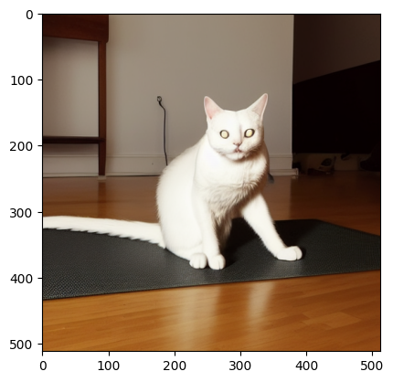

# Quantizing and Pruning Diffusion Models

```
Team Members: Pranjal Srivastava (ps3392), Rishabh Srivastava (rs4489)
```

## Project Overview

Diffusion models, particularly in image generation and representation learning, have demonstrated remarkable capabilities in capturing complex data distributions. However, since these models use an iterative refinement process and have multiple components, they need a lot of resources during inference. Thus, deploying these models in resource-constrained environments, such as edge devices and mobile platforms, poses challenges due to their computational intensity.

Thus, the primary objective of this project is to investigate the impact of acceleration techniques like **quantization** and **pruning** on the inference of latent diffusion models.

## Code Structure

    README.md
    code
    ├── data
    ├── stable_diffusion
    ├── quantisation
    ├── utility.py
    ├── main.py
    ├── pruning_experiment.py
    ├── quant_experiment_script.py
    ├── prune_quantize_model.py
    ├── pruning_profile_exp.py

The `data` folder contains the CLIP tokenizer vocabulary files, weights of the pre-trained Stable Diffusion model, and sample images used to calculate the FID score.

The `stable_diffusion` folder contains all the necessary code to create the Stable Diffusion model from the pre-trained model's weights.

The `quantisation` folder contains the modules for quantisation.

The `utility.py` file has some helper functions, and the `pruning_experiment.py` file has the code for the pruning experiments. The `main.py` file runs the pruning experiments and logs the results in Weights & Biases. 

## Dependencies

- PyTorch
- PyTorch Lightning
- Numpy
- Matplotlib
- tqdm
- Transformers
- Wandb
- Torchmetrics
- Dotenv

## Installation and Running the Experiments
To download the pre-trained model's weights, run the following command:
```bash
mkdir data/weights
wget https://huggingface.co/runwayml/stable-diffusion-v1-5/resolve/main/v1-5-pruned-emaonly.ckpt -O ./data/weights/v1-5-pruned-emaonly.ckpt
```

To run the quantization experiments, execute the command below:
```bash
python quant_experiment_script.py config.yaml
```

To run the pruning experiments, execute the command below:
```bash
python main.py
```
By default, the pruning experiments prune the model unstructurally. You can provide the argument to `run_pruning_exp()` as `True` in `main.py` file to run the experiments for pruning the model structurally.
You can also run profiling experiments for pruning via the `main.py` script.

To run the combination of pruning and quantization experiments, execute the command below:
```bash
python prune_quantize_model.py config.yaml
```


### Quantization Description
The quantization module simulates quantization based on parameters specified by the `config.yaml`.
We implement different strategies for quantization, which can be accessed via different parameters.

The file `uniform_symmetric_quantiser.py` has the quantizer which can quantize inputs to a symmetric range as per the specified `n_bits`.

The quantisation module implements two models that serve as wrappers for a base diffusion model. They are:

- <u>QuantModel</u>: Supports n-bits symmetric quantization with possible scale strategies of `mse` and `max`
- <u>TimeStepCalibratedQuantModel</u>: Implements time-step aware quantization for activations, supports possible scale strategies of `mse` and `max`. Parametrised by number of timesteps and <i>k</i>, a constant denoting the number of intervals in the timesteps.

We also implement a custom Calibrator, which calibrates the quantisation modules as per the policies:

- ACT_SCALE_POLICY: How to scale the activations for quantization. Possible values are `max` for absolute max and `mse` for Lp-norm-based scaling.
- ACT_UPDATE_POLICY: How to update the step parameter of the quantizer. Possible values are `maximum`, for maximum of values through the run, and `momentum` for a weighted exponential average of the scales.

Refer to `config.yaml` for a more detailed description of possible parameters.

To load a quantized model, we can do the following:
```bash
from stable_diffusion import *
from stable_diffusion.model_loader import load_from_standard_weights
from transformers import CLIPTokenizer

tokenizer = CLIPTokenizer("<path_to_vocab_file>",
                          merges_file="<path_to_merges_file>")
clip = CLIP()
encoder = VAE_Encoder()
decoder = VAE_Decoder()
diff = Diffusion()

state_dict = load_from_standard_weights('<path_to_weights>')
clip.load_state_dict(state_dict['clip'], strict = True)
encoder.load_state_dict(state_dict['encoder'], strict = True)
decoder.load_state_dict(state_dict['decoder'], strict = True)
diff.load_state_dict(state_dict['diffusion'], strict = True)

quantised_diff = QuantModel(diff, weight_quant_params={'n_bits': 8}, act_quant_params={'n_bits': 8})

OR

quantised_diff = TimeStepCalibratedQuantModel(diff, timesteps = 40, k = 5, weight_quant_params={'n_bits': 8}, act_quant_params={'n_bits': 8}, quant_filters = filters)
```

## Experimental Results and Observations

### Quantization

Different methods for quantization were studied along with their generated images.

We also present a new method for quantization called **Timestep aware quantization**.

Following were the interesting takeaways:

- If we just quantize the weights, we can quantize the entire network without loss of much capabilities.

- Quantizing activations is harder, we skip the first and the last layer during quantizing activations as well as weights.

- Scaling  based on MSE works better than scaling based on MAX value.

- Our proposed approach, Time step aware quantization improves the performance significantly over vanilla quantization techniques.

More experiment details are available at the wandb page ([here](https://wandb.ai/pranjal_sri/stable-diff-quantisation?nw=nwuserpranjal_sri)). Following are some representative images:

<figure>
    <figcaption><b>Image by Base Diffusion Model</b></figcaption>
    
</figure>
<br>
<figure>
    <figcaption><b>Quantizing weights and activations</b></figcaption>
    
</figure>
<br>
<figure>
    <figcaption><b>Quantizing weights and activations with mse</b></figcaption>
    
</figure>
<br>
<figure>
    <figcaption><b>Time step aware</b></figcaption>
    
</figure>


### Pruning
[//]: # "WandB Experiment 1 link: [Experiment 1](https://wandb.ai/hpmlcolumbia/quantization_pruning/reports/Quantization-and-Pruning--Vmlldzo3ODE1MDQ5?accessToken=5m0vlrzjcw6gyayrputy8legp1buvphuvc5esm4v6vttq9710xux9biaqx5zz5fa)"

[//]: # "WandB Experiment 1 link: [Experiment 1](https://wandb.ai/hpmlcolumbia/quantization_pruning/reports/Pruning-Experiments--Vmlldzo3ODIzMTU4?accessToken=taan0iakgdmmv6rx0herulahv1o17ik83lhz6ewdzvkgiz0y8iwdnokpcwr9br5e)"

[//]: # "WandB Experiment 2 link: [Experiment 2](https://wandb.ai/hpmlcolumbia/quantization_pruning/reports/Experiment-3-CLIP-Scores-for-Pruned-Models--Vmlldzo3ODI2NDY0?accessToken=5m2g4dq157s98aqs16mshug68igg3khb0a70cjlovydbgpmgzrvzolzgxknyxdpn)"

[//]: # "WandB Experiment 3 link: [Experiment 3](https://wandb.ai/hpmlcolumbia/quantization_pruning/reports/Pruning-Experiments-Linear-Conv-Layers-of-UNet--Vmlldzo3ODM1MjM3?accessToken=7ik20yrk4lcvah1fehubxnbk28fid9s3jxjz18qd5vrlha7xniu8pi4zzawkurya)"

L1-unstructured pruning was carried out on all the linear and convolutional layers of the UNet architecture of the Diffusion model. The results can be seen in the report below:

WandB Experiment Report link for L1-unstructured Pruning: [L1-unstructured Pruning Experiments](https://wandb.ai/hpmlcolumbia/quantization_pruning/reports/Quantitative-Analysis-of-Pruned-Models--Vmlldzo3ODQxMjAx?accessToken=zotsiub1f124mwqrsu346hgyqpti1iiz8fnejg8kp3xuvq9pbeq0uvwe8v984zm5)

The experiments show that pruning till 30-35% give us satisfactory results, but further pruning degrades the performance heavily.

The results and analysis of the pruning experiments are displayed below:

<figure>
    <figcaption align = 'center'><b>Quantitative Analysis of Pruned Models</b></figcaption>
    
</figure>
<br>
<figure>
    <figcaption align = 'center'><b>Sample Results for Pruned Models</b></figcaption>
    
</figure>

We also experimented with structural pruning of weights of UNet, where we pruned channels based on L2 norm. However, we observed a heavy degradation in performance after 5% pruning only. This can be seen from the figures below.

WandB Experiment Report link for Structured Pruning: [Structured Pruning Experiments](https://wandb.ai/hpmlcolumbia/quantization_pruning/reports/Quantitative-Analysis-of-Structurally-Pruned-Models--Vmlldzo3ODY3ODcy?accessToken=d73ww1hoexbvsoxa90qei1k11tl9pyicxqxi01l8sdmst3ssza54h9w98mhc5aao)
<figure>
    <figcaption align = 'center'><b>Quantitative Analysis of Structurally Pruned Models</b></figcaption>
    
</figure>
<br>
<figure>
    <figcaption align = 'center'><b>Sample Results for Structurally Pruned Models</b></figcaption>
    
</figure>

We also carried out profiling of the different components of diffusion model, and the impact of pruning. As observed from the [WandB report for the experiments](https://wandb.ai/hpmlcolumbia/quantization_pruning/reports/Profiling-of-Unstructured-Pruned-UNet--Vmlldzo3ODgyODA4?accessToken=pj5m09g0rfioulo4pfgbe64usaiy22477um3cddl2g69kffbv4ynexnl2abieidm), it is clear that the time for UNet to complete the timesteps reduces as the model is pruned more.
Note that the times are averaged for each experiment type.
<figure>
    <figcaption align = 'center'><b>Profiling Results for Unstructured Pruned Models</b></figcaption>
    
</figure>

### Pruning + Quantization

We got good results when we pruned our model unstructurally (L1-norm) by 20% and used Timestep Aware Calibrated Model with MSE for scaling the activations.

The WandB Experiment results are [here](https://api.wandb.ai/links/hpmlcolumbia/ta2q28tz).

<figure>
    <figcaption align = 'center'><b>Results for Pruning and then Quantizing</b></figcaption>
    
</figure>
